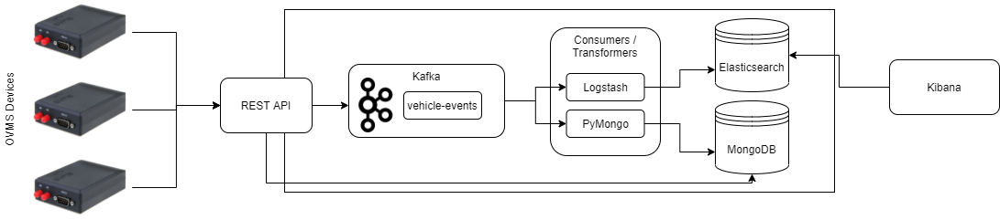

# st1612
### Proyecto Final
Sistema de monitoreo de vehículos eléctricos usando Kafka, MongoDB, Elasticsearch y Kibana.

<!-- TOC -->

- [st1612](#st1612)
    - [Proyecto Final](#proyecto-final)
    - [Integrantes](#integrantes)
    - [Arquitectura de la solución](#arquitectura-de-la-solución)
    - [Instrucciones de Replicación](#instrucciones-de-replicación)
        
        - [Api-REST](#implementación-de-api-rest-con-flask)
        - [Distositivo IoT](#dispositivo-de-monitoreo)
        - [Kafka](#kafka)
        - [Consumidor Logstash](#consumidor-logstash)
        - [Consumidor PyMongo](#consumidor-pymongo)
        - [Elasticsearch](#elasticsearch)
        - [MongoDB](#mongodb)
        - [Kibana](#kibana)

<!-- /TOC -->

### Integrantes

* Santiago Echavarria Correa - sechava4@eafit.edu.co
* Hamilton Tobon Mosquera - htobonm@eafit.edu.co

### Arquitectura de la solución



### Instrucciones de Replicación

### Implementación de API-REST con flask
Con el fin de proveer un punto de comunicación entre los
dispositivos de monitoreo y kafka, se propone implementar una 
api que exponga un endpoint accesible por medio del protocolo HTTP. 
Utilizamos el framework de python llamado flask para dicho implementación gracias 
a su versatilidad y fácil configuración.

El primer paso es instaciar una máquina EC2 t2.medium con Ubuntu 20, con acceso al puerto 80. Luego de esto,
procedemos a instalar los requerimientos, en este caso python y NGINX para redirigir
la aplicación al puerto 80.
```
sudo apt-get -y install python3 python3-venv python3-dev
sudo apt-get -y install nginx
```

Luego, estando en el directorio del proyecto, procedemos a crear un ambiente virtual
de python y a instalar allí todas las dependencias:
```
python3 -m venv venv
source venv/bin/activate
pip install -r requirements.txt
```
Luego de esto, podemos verificar que el servicio se pueda ejecutar sin problemas,
simplemente corriendo:
```
python app.py
```
Una vez verificado esto, configuramos NGINX para que redirija la aplicación de
localhost:8080 al puerto 80, para que sea publicamente visible y accesible 
a los dispositivos.
```
sudo nano /etc/systemd/system/app.service
```
Copiamos allí el contenido de app.service y guardamos. Luego:
```
sudo systemctl start app
sudo systemctl enable app
sudo nano /etc/nginx/sites-available/app
```
Copiamos el contenido de sites_available_app y guardamos. Luego:
```
sudo ln -s /etc/nginx/sites-available/app /etc/nginx/sites-enabled
sudo rm -r /etc/nginx/sites-enabled/default
sudo nginx -t
sudo systemctl restart nginx
```
Verificamos que todo este funcionando correctamente mediante:
```
sudo systemctl status app
sudo systemctl status nginx
```

### Dispositivo de monitoreo
El OVMS se configura mediante un archivo de configuración en javascript el cual 
se encuentra como ovms_vehicle.js. Allí básicamente se leen diferentes variables
del vehículo y se añaden como query parameters a la url del servicio de flask. 
Se configura para que cada 8 segundos haga el envío de información.


#### Kafka
Instalación:

    sudo yum install java-1.8.0
    wget https://archive.apache.org/dist/kafka/2.8.0/kafka_2.12-2.8.0.tgz
    tar xvf kafka_2.12-2.8.0.tgz
    rm kafka_2.12-2.8.0.tgz
    cd kafka_2.12-2.8.0

Iniciar Zookeper:

    bin/zookeeper-server-start.sh -daemon config/zookeeper.properties

Iniciar el servidor de Kafka:

    bin/kafka-server-start.sh -daemon config/server.properties

Crear el tópico `vehicle-events`:

    bin/kafka-topics.sh --create --topic vehicle-events --bootstrap-server localhost:9092

#### Consumidor Logstash
Instalación:

    wget https://artifacts.elastic.co/downloads/logstash/logstash-7.12.1-linux-x86_64.tar.gz
    tar xvf logstash-7.12.1-linux-x86_64.tar.gz
    rm logstash-7.12.1-linux-x86_64.tar.gz

Configuración:

    cp logstash-kafka.conf logstash-7.12.1/conf/

Arranque:

    cd logstash-7.12.1
    bin/logstash -f config/logstash-kafka.conf 2>&1 > /dev/null &

#### Consumidor PyMongo
Recuerde instalar los requerimientos:

    source venv/bin/activate
    pip install -r requirements.txt

Arranque:

    source venv/bin/activate
    python mongodb_consumer.py 2>&1 > /dev/null &

#### Elasticsearch
Instalación:

    wget https://artifacts.elastic.co/downloads/elasticsearch/elasticsearch-7.12.0-linux-x86_64.tar.gz
    tar xvf elasticsearch-7.12.0-linux-x86_64.tar.gz
    rm elasticsearch-7.12.0-linux-x86_64.tar.gz

Arranque:

    cd elasticsearch-7.12.0-linux-x86_64
    bin/elasticsearch -d

Verifique que está funcionando:

    curl -XGET http://localhost:9200/_cat/indices/vehicle-events

#### MongoDB
Por facilidad se instaló MongoDB usando Docker, por tanto, siga primero la guía de
[instalación de Docker](https://docs.docker.com/engine/install/ubuntu/).

Una vez instalado Docker, ejecute el siguiente comando:

    docker run --name mongodb \
        -d mongo:latest \
        -p 27017-27019:27017-27019 \
        -v mongodb_data:/data/db

Verifique que MongoDB esté corriendo:

    ss -ltn

Debería ver que los puertos predefinidos de MongoDB están abiertos, obteniendo una salida
parecida a la siguiente:`

    State    Recv-Q   Send-Q          Local Address:Port      Peer Address:Port   Process
    LISTEN   0        4096                  0.0.0.0:27017          0.0.0.0:*
    LISTEN   0        4096                  0.0.0.0:27018          0.0.0.0:*
    LISTEN   0        4096                  0.0.0.0:27019          0.0.0.0:*


#### Kibana
Instalacion:

    curl -O https://artifacts.elastic.co/downloads/kibana/kibana-7.12.0-linux-x86_64.tar.gz
    tar xvf kibana-7.12.0-linux-x86_64.tar.gz
    rm kibana-7.12.0-linux-x86_64.tar.gz
    cd kibana-7.12.0-linux-x86_64

Configuración: Descomente las siguientes líneas en el archivo: `config/kibana.yml`.

    elasticsearch.hosts: ["http://localhost:9200"]
    server.port: 5601
    server.host: "0.0.0.0"

Arranque:

    nohup bin/kibana &

Verifique que Kibana esta corriendo al acceder a la dirección IP pública de la máquina que se
está usando en el puerto `5601`.

### Para cargar cambios en la aplicación:
```
git pull
sudo systemctl restart app
```
